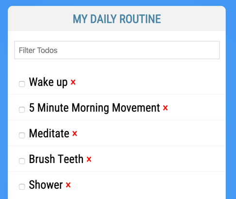
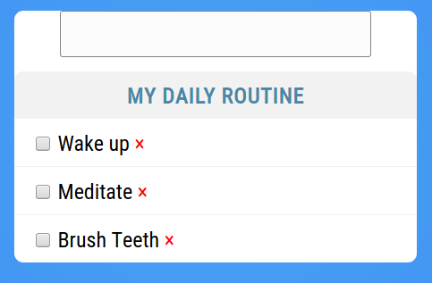
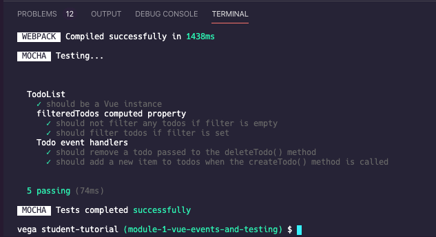

# VueJS Event Handling and Unit Testing Tutorial

In this tutorial, you'll work on event handling in Vue.js. You'll take the Todo List you built out and add some interactivity to it.

## Event Handling

You've already added the ability to check and uncheck a todo item and filter the list of todo items using data binding. Simple functionality like this doesn't need event handling, but something more complex might. What about deleting a todo item or adding a new one?  

These tasks require changing the array of items by removing an item or adding a new item.  Data binding alone isn't enough, so today, you'll add both of these functions to the todo list.

### Step One: Remove an item

First, add a control to each todo item that looks like `<span class="delete">×</span>`:

``` HTML
<li v-for="todo in filteredTodos" v-bind:key="todo.name"
    v-bind:class="{ finished: todo.done }">
    <input type="checkbox" v-model="todo.done" />
    {{ todo.name }} <span class="delete">×</span>
</li>
```

This is the control used to delete an item. A click on the `×` triggers a handler to remove the item.

Now create the handler. The event handler lives in the `methods` section of the component. It's a JavaScript function that is called when a certain action happens in the browser—in this case, a click on the `span` element you created.

For the delete, create a new method called `deleteTodo` that takes the todo as an argument and then filters that todo out of the `this.todos` list:

``` JavaScript
methods: {
    deleteTodo(todoToDelete) {
        this.todos = this.todos.filter((todo) => {
            return todo !== todoToDelete;
        });
    }
}
```

Then, use that method to handle click events on the `span` you created:

``` HTML
<span class="delete" v-on:click="deleteTodo(todo)">×</span>
```

This says that when a click is found on this span, the `deleteTodo` method is called, passing in the current `todo` as its argument. This then runs the method, filtering that todo out of the list of todos.

Notice that it's isn't clear whether or not someone can click on the `x`. To create the presentation of the `x`, add some CSS:

``` CSS
.delete {
    color: red;
    cursor: pointer;
}
```

Now the `×` is red and shows the appropriate mouse pointer.



### Step Two: Add an item

Adding a new item requires a form and input box to take input from the user and then add that information to the `todos` list.

First, make a new form below the unordered list:

``` HTML
<form>
    <input type="text" v-model="newItem" placeholder="Add new Todo" />
    <button type="submit" class="btn save">Save</button>
</form>
```

Since the input box is bound to a data property called `newItem`, make that property in the `data()` function:

``` JavaScript
data() {
    return {
        filterText: '',
        newItem: '',
        ...
```

Now you need to handle when the form is submitted—that is, when the user hits enter in the input box after typing, the form is submitted.

First, create a new event handler in `methods`:

``` JavaScript
deleteTodo(todoToDelete) {
    this.todos = this.todos.filter((todo) => {
        return todo !== todoToDelete;
    });
},
createTodo() {
    this.todos.push({
        name: this.newItem,
        done: false
    });
}
```

Then, connect that to a submit event on the form:

``` HTML
<form v-on:submit="createTodo">
    <input type="text" v-model="newItem" placeholder="Add new Todo" />
    <button type="submit" class="btn save">Save</button>
</form>
```

If you try this now, you'll notice that the item is added, but the page immediately refreshes and reloads the default items. Why is that?

It is because, by default, a browser always loads a new URL on any form submission. You need to prevent that default behavior if you don't want that to happen. To do this, add `.prevent` to your `v-on`:

``` HTML
<form v-on:submit.prevent="createTodo">
    <input type="text" v-model="newItem" placeholder="Add new Todo" />
    <button type="submit" class="btn save">Save</button>
</form>
```

Notice that while the item is added, the input box still has text in it. When you handle the form in Vue, remember to clean up the input boxes once your actions are complete.

To do that, add the following line to your method:

``` JavaScript
createTodo() {
    this.todos.push({
        name: this.newItem,
        done: false
    });
    this.newItem = '';
}
```

Due to two-way binding, you'll see the input box is also cleared.



## Step Three: Add unit tests

Now you'll take the todo application and add some unit tests to it. Unit testing a Vue component involves calling the methods and computed properties to make sure their logic is correct and performs the correct tasks.

### 1. Testing setup

Right now, you only have a single component—`TodoList.vue`—so you only need to create one testing specification (testing spec). Go into the `tests/unit` folder and create a new file called `TodoList.spec.js`. Remember that the convention is to follow the name of your component + .spec + .js.
Copy the code below and paste it into the file you just created. 

> The student book discusses these steps in detail. If you've forgotten how to create your testing specs, re-read the chapter before continuing.

```javascript
import TodoList from '@/components/TodoList';
/* eslint-disable-next-line no-unused-vars */
import { shallowMount, Wrapper } from '@vue/test-utils';

import chai from 'chai';
chai.should();

describe('TodoList', () => {

    /** @type Wrapper */
    let wrapper;

    beforeEach( () => {
        wrapper = shallowMount(TodoList);
    });

    it('should be a Vue instance', () => {
        wrapper.isVueInstance().should.be.true;
    });

});
```

You should be able to run your tests now using the command `npm run test:unit`. If you are successful, you'll see one test passing.

## Step Four: Write your tests

Now that you've set up the testing specs, you can write your individual tests. When you write your tests, use a descriptive name. This way, anyone who runs your tests knows what they test.

In this tutorial, you'll test the `filteredTodos()` computed property and the `deleteTodo()` and `createTodo()` methods.

### 1. Test computed properties

First, set up a `describe()` function that you can group tests about the `filteredTodos()` in. This helps you organize your tests.

``` JavaScript
describe("filteredTodos computed property", () => {

});
```

Next, set up the testing function. It's important to use a descriptive name for the test so that you know what's wrong if the test fails. This test tests that no todos are filtered out if the filter is empty: 

``` JavaScript
describe("filteredTodos computed property", () => {
    it("should not filter any todos if filter is empty", () => {

        wrapper.vm.filteredTodos.length.should.equal(3);
    });
});
```

The first step of this process is to set the component's data to a set of known test data. Never use data that is already set on the component because that data could change at any time.  It could break the tests even though nothing is wrong with the code. Tests should always set and control the data they work with so that they don't break on an unexpected change.

Add in a `setData()` call to create three test todos and an empty `filterText`:

``` JavaScript
it("should not filter any todos if filter is empty", () => {
    wrapper.setData({
        filterText: '',
        todos: [
            {
                name: "first"
            },
            {
                name: "second"
            },
            {
                name: "third"
            }
        ]
    });
});
```

> ##### Why is `done` missing from the todos?
> You'll notice in the component that there is a `done` property on all the todos that was left off in the tests. Is that allowed?
>
> Yes, it is allowed. In fact, it's encouraged. Because the computed property being tested, `filteredTodos`, never touches the `done` property of the todos, it doesn't need to be included here for testing. You should only set the data that is needed for the test to work and leave the rest out.

Then you can make sure that the `filteredTodos` returns all three test todos:

``` JavaScript
it("should not filter any todos if filter is empty", () => {
    wrapper.setData({
        filterText: '',
        todos: [
            {
                name: "first"
            },
            {
                name: "second"
            },
            {
                name: "third"
            }
        ]
        });
        wrapper.vm.filteredTodos.length.should.equal(3);
    });
});
```

If you run the tests now, you should see the newly passing test that was added.

You can also add a test to make sure that the filter works when filled in. Try writing that test on your own. Once you're done, look at the example test below to see how it could be done:

``` JavaScript
it("should filter todos if filter is set", () => {
    wrapper.setData({
        filterText: 'r',
        todos: [
            {
                name: "first"
            },
            {
                name: "second"
            },
            {
                name: "third"
            }
        ]
    });
    wrapper.vm.filteredTodos.length.should.equal(2);
    wrapper.vm.filteredTodos[0].name.should.equal('first');
    wrapper.vm.filteredTodos[1].name.should.equal('third');
});
```

In the example, it not only checks that to make sure only two todos are returned, but that the correct todos came back. If you run the tests now, you should see the newly passing test that was added.

### 2. Test methods

You should also test methods to make sure that they work as expected. As you did with the computed properties, set up a `describe()` to organize your event handler tests:

```js
describe('Todo event handler methods', () => {

});
```

First, test that the `deleteTodo()` method properly deletes todo items. To do this, the test sets the test data, passes a todo from the test data into the method, and then checks that the todo is gone from the data. Be sure to create this test outside of the `filteredTodos` describe method:

``` JavaScript
it("should remove a todo passed to the deleteTodo() method", () => {
    const testTodo = { name: "TEST" };
    wrapper.setData({
        todos: [
            testTodo,
            { name: "DON'T DELETE" }
        ]
    });
    wrapper.vm.deleteTodo(testTodo);
    wrapper.vm.todos.length.should.equal(1);
    wrapper.vm.todos[0].name.should.equal("DON'T DELETE");
});
```

Then add a test to make sure that `createTodo()` properly creates a todo item:

``` JavaScript
it("should add a new item to todos when the createTodo() method is called", () => {
    wrapper.setData({
        todos: [],
        newItem: "NEW TODO"
    });
    wrapper.vm.createTodo();
    wrapper.vm.todos.length.should.equal(1);
    wrapper.vm.todos[0].name.should.equal("NEW TODO");
    wrapper.vm.todos[0].done.should.be.false;
});
```

Remember to check that the done property is set to the correct value since it is set by the `createTodo()` method.

Once all your tests are passing, you should see something similar to the screenshot below:



## Summary

In this tutorial, you wrote code that:

- Handled events on a simple click
- Handled a form submission
- Made the data more dynamic in your component using methods

You also wrote tests that:
- Verified the correct behavior of a computed property
- Verified the correct behavior of methods
